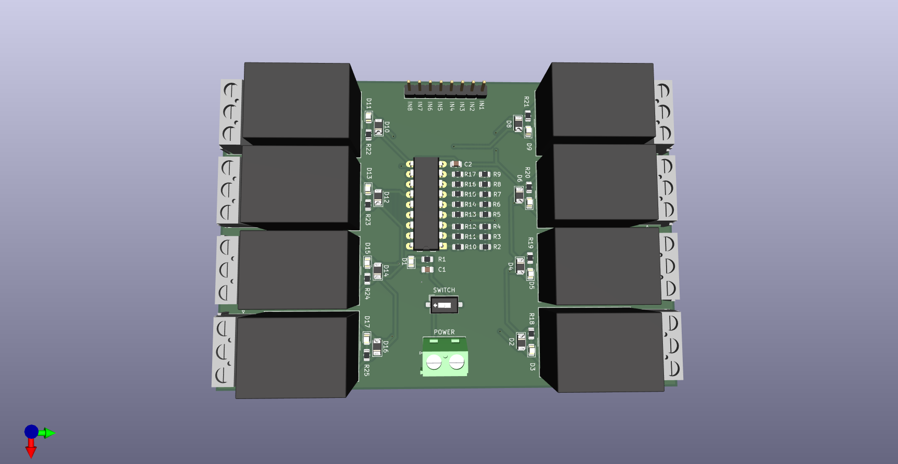

#  8 Channel Relay Module

## 🔌 Project Overview
This project demonstrates the design of an **8 Channel Relay Driver Board** capable of controlling **multiple AC/DC loads** through microcontrollers like **Arduino, ESP32, or Raspberry Pi**.  
Each relay can be triggered individually, allowing automation of lights, fans, and other appliances.

---

## 📷 Project Images

| PCB Layout | Schematic | 3D View |
|-------------|------------|---------|
|  |  |  |

---

## ⚙ Circuit Working

| Stage | Component | Function |
|--------|------------|-----------|
| **Input Control** | Signal Pins (IN1–IN8) | Control each relay channel via Arduino or ESP32 |
| **Relay Driver** | Transistors / ULN2803 | Acts as a switching driver between microcontroller and relay |
| **Relays** | 8× SPDT (5V or 12V) | Switch AC/DC loads up to 10A |
| **Indicator LEDs** | 8 LEDs | Indicate active relay channels |
| **Power Section** | JD-VCC, VCC, GND Pins | Provides isolated power for relay coils and logic |

---

## ✅ Features

- **8 independent relay channels**
- **Optocoupler / transistor isolation** for safety
- **LED indicators** for each channel
- **Screw terminal outputs** for easy load connection
- Compatible with **Arduino, ESP32, Raspberry Pi, and STM32**

---

## 🧾 Components List

| Component | Specification | Quantity |
|-----------|----------------|-----------|
| Relays | SPDT, 5V or 12V, 10A | 8 |
| Transistor / Driver IC | ULN2803 / BC547 | 8 / 1 |
| Resistors | 1kΩ–10kΩ | As required |
| Indicator LEDs | Red | 8 |
| Screw Terminals | 2-Pin / 3-Pin | 8 |
| Input Header | 10-Pin Male Header | 1 |
| Power Supply Pins | JD-VCC, VCC, GND | 1 set |

---

## ⚡ Applications

- **Home automation systems**
- **Industrial control**
- **Smart IoT devices**
- **Multiple appliance switching**
- **Arduino and ESP32 projects**

---

## 🧑‍💻 Author

**Bhargav Ram**  
Electronics and Communication Engineering Student  
Passionate about **Embedded Systems | IoT | PCB Design**

---

⭐ *If you like this project, give it a star on GitHub and share your feedback!*
